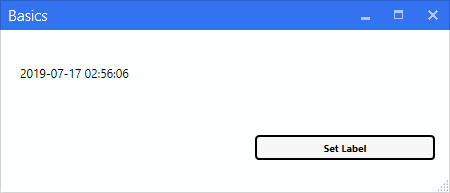
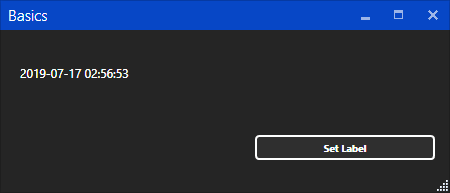
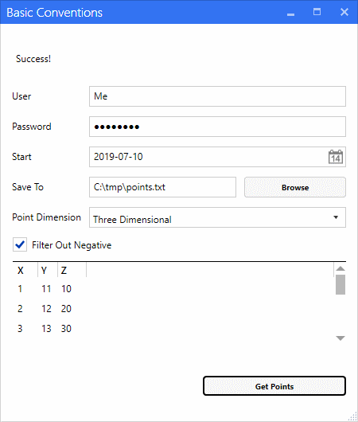
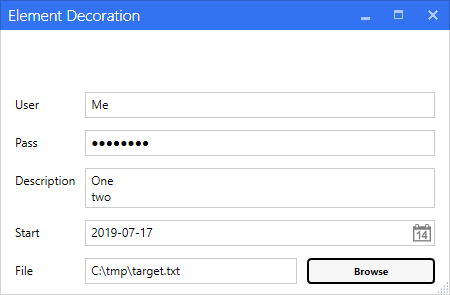
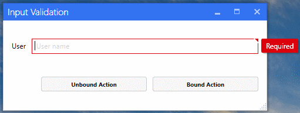
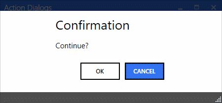
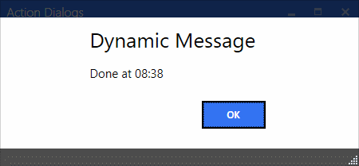
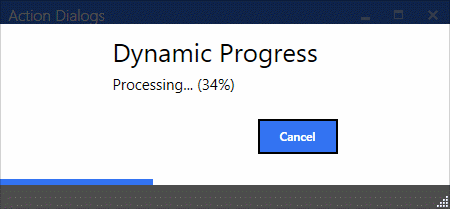
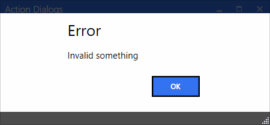
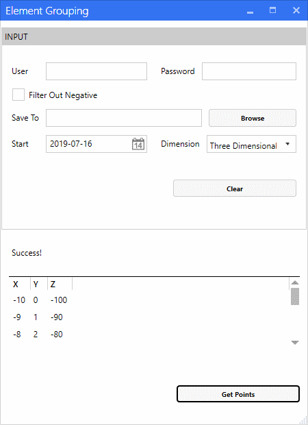

# MechaView

The tool wraps your plain C# inside a single exe WPF app.

## Run it
1. Create a class library (.NET Framework 4.5+)
2. Add [nuget]()
3. Define your view model (see below)
4. Run `start-app` from Package Manager Console
5. Get the single exe inside your bin folder (ignore the other files)

## Basics
The application consists of your view model and the `App` class defined in the global namespace. It has to both have the exact name and implement the `IApp` interface.

```csharp
using System;
using Mecha.Wpf.Settings;

public class App : IApp
{
    public void Init(AppSettings s)
    {
        s.Title = "Basics";
        s.Window.Width = 450;
        s.Content = typeof(BasicsVM);
    }
}
public class BasicsVM
{
    public virtual string Label { get; set; }
    public void SetLabel() { Label = DateTime.Now.ToString(); }
}
```



## Element Conventions
Conventions affect how each property is represented and are defined for both types and names. In simple cases, we may rely solely on them. The following example uses the keywords Label, Password, and Path. The remaining controls are derived from the property types.

```csharp
public class ElementConventionsVM
{
    public virtual string StatusLabel { get; set; }

    public virtual string User { get; set; }
    public virtual string Password { get; set; }
    public virtual DateTime Start { get; set; }
    public virtual string SaveToPath { get; set; }
    public enum Dimension { ThreeDimensional, TwoDimensional }
    public virtual Dimension PointDimension { get; set; }
    public virtual bool FilterOutNegative { get; set; }
    
    public virtual Point[] Points { get; set; }

    public async Task GetPoints() { . . . }
}
```


## Element Decoration

A property can be decorated with a matching attribute, which also lets us specify the additional configuration. In the example below, we set most of the text inputs to remember their value by specifying the `Persistent` flag. On the `File` property, we restrict the file dialog only to certain file types.

```csharp
public class InputDecorationVM
{
    [Readonly]
    public virtual string Status { get; set; }

    [TextInput]
    public virtual string User { get; set; }

    [Password(Persistent = true)]
    public virtual string Pass { get; set; }

    [TextInput(Persistent = true, Multiline = true)]
    public virtual string Description { get; set; }

    [DateInput(Persistent = true)]
    public virtual DateTime Start { get; set; } = DateTime.Now;

    [Path("txt", "md", Type = PathType.Open, Persistent = true)]
    public virtual string File { get; set; }
}
```



## Input Validation

Each input property can be marked as `Mandatory`. Doing so prevents all default actions (i.e. methods) to run as long as the mandatory inputs are empty. An action can be specified as unbound by setting `DisableValidtion`.

```csharp
public class InputValidationVM
{
    [TextInput(Mandatory = true, Description = "User name")]
    public virtual string User { get; set; }

    public void BoundAction() { }

    [Action(DisableValidation = true)]
    public void UnboundAction() { }
}
```



## Action Dialogs
There are static and dynamic dialogs. Static ones are specified by decorating an action (i.e. method) with the `Confirm`, `Progress`, or `Message` attributes. Dynamic dialogs are specified by defining an `IMechaMessage` or `IMechaProgress` (or both) parameters. The method can return either `void` or `Task`. If a progress dialog is specified, it is shown until the method finishes.

```csharp
public class ActionDialogsVM
{
    public virtual string StatusLabel { get; set; }

    [Confirm("Confirmation", "Continue?")]
    [Progress("Static Progress", "Processing...")]
    [Message("Static Message", "Done")]
    public async Task StaticAll()
    {
        await Task.Delay(1500);
    }

    public void DynamicMessage(IMechaMessage msg)
    {
        msg.Title = "Dynamic Message";
        msg.Message = "Done at " + DateTime.Now.ToShortTimeString();
    }

    public async Task DynamicProgress(IMechaProgress prog)
    {
        prog.Title = "Dynamic Progress";
        prog.IsCancelable = true;

        for (int i = 0; !prog.IsCanceled && i < 100; i++)
        {
            prog.Progress = .01 * i;
            prog.Message = $"Processing... ({i}%)";
            await Task.Delay(10);
        }
    }

    public void ThrowError()
    {
        throw new Exception("Invalid something");
    }
}
```







## Element Grouping

Each element can be grouped by specifying `Group` and ordered within the group by setting `Position` . `Position` is of type double where the integer part represents a row and the fraction part represents a column. Keep in mind that each value represents order and not a fixed position.

```csharp
public class ElementGroupingVM
{
    enum Grp
    {
        Input,
        [Group(invisible: true)] Result
    }

    //
    // Input
    //

    [Element(Group = Grp.Input, Position = 0.0)]
    public virtual string User { get; set; }

    [Element(Group = Grp.Input, Position = 0.1)]
    public virtual string Password { get; set; }

    [Element(Group = Grp.Input, Position = 1)]
    public virtual bool FilterOutNegative { get; set; }

    [Element(Group = Grp.Input, Position = 2)]
    public virtual string SaveToPath { get; set; }

    public enum PointDimension { ThreeDimensional, TwoDimensional }
    [Element(Group = Grp.Input, Position = 3.0)]
    public virtual DateTime Start { get; set; } = DateTime.Now.AddDays(-1);

    [Element(Group = Grp.Input, Position = 3.1)]
    public virtual PointDimension Dimension { get; set; }

    [Element(Group = Grp.Input)]
    public void Clear()
    {
        User = Password = SaveToPath = null;
    }

    //
    // Result
    //

    [Element(Group = Grp.Result)]
    public virtual string StatusLabel { get; set; }

    [Element(Group = Grp.Result)]
    public virtual Point[] Points { get; set; }

    public async Task GetPoints() { . . . }
}
```




## Full Examples
Get the above examples in the `Samples` folder.
